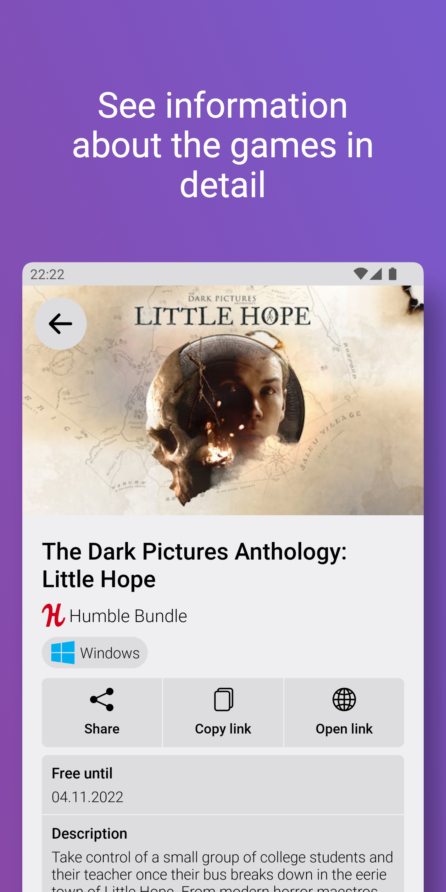
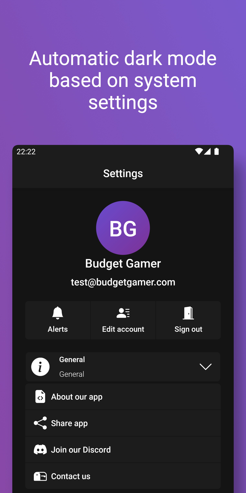
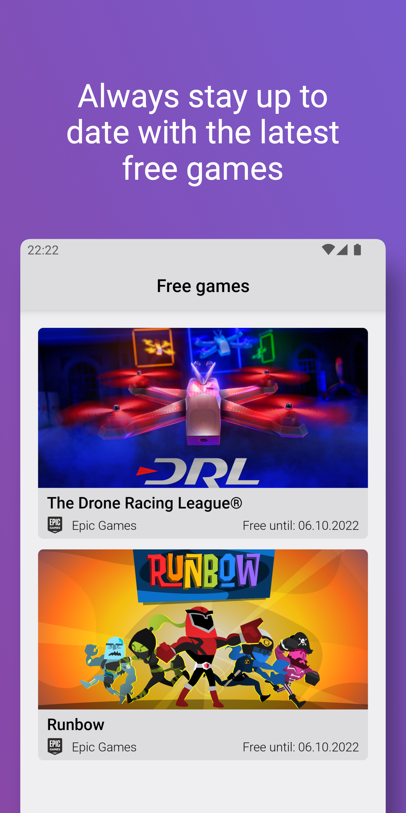

# Budget Gamer Android

### Keep track of fully discounted games.

Never lose a game again. Game stores often have time limited giveaways or bundles for free games on PC, Xbox and Playstation, so you have to be fast to not miss them. "Budget Gamer" checks your favorite stores like Steam, Epic Games, Xbox, GoG, Humble Bundle and Playstation, so you don't have to. The most common are Steam Free Weeks and Free Weekends and the Free Epic Games of the Week from the Epic Games Store, which are free-to-keep!

It's our job to find the best free game offers for you and gather them in one place. Our smart and efficient algorithm is constantly searching all the stores and gaming platforms to save your time, energy and money!

Budget Gamer notifies you when a new offer for a free game starts or when a giveaway is about to end.

## Libraries & Technologies

- Dagger Hilt
- Kotlin, Coroutines, Coil, DataStore, Room
- Firebase: Realtime Database, Storage, Authentication, Crashlytics, Messaging
- Retrofit, Okhttp, Gson

## Features

- List of free games on all platforms Steam, Epic Games, Humble Bundle, Xbox, GOG and Playstation
- Filter by Store
- Optional notifications when new offers start
- Dark mode
- The application doesn’t have any ads and is completely free, we do not make any profit from discounts and free games. So download Budget Gamer and never miss any free games again!

## Screenshots

## Contact Us

Don't hesitate to contact us if you have any questions.

Via Email: [contact@budgetgamer.app](mailto://contact@budgetgamer.app)